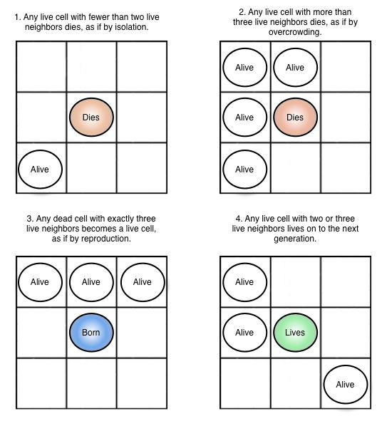
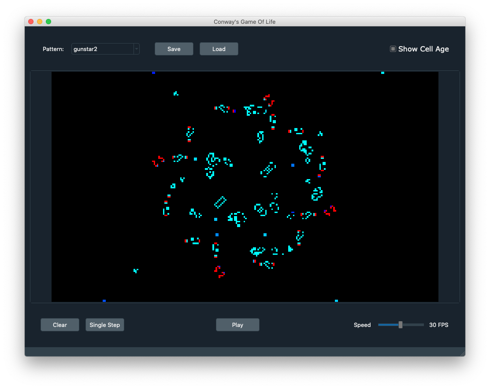

# Conway's Game of Life
Python implementation of the Conway's Game of Life using PyQt5 and Numpy.

## Game of Life
The Game of Life is a cellular automaton, that is a grid system composed of cells which can assume a finite number of states and base on a set of
rules applied to cells and their neighbors.  
It was devised by the British matematician John Horton Conway in 1970 as a simplification of the John von Neumann original idea to realize a cellular automaton that
simulated a Turing machine.  
For further info feel free to check the relative [Wikipedia page](https://en.wikipedia.org/wiki/Conway%27s_Game_of_Life).

## Automaton definition and rules
In its original formulation, the Game of Life is defined over an infinite grid of cells with only two states: dead or alive.  
At each time step the grid state is updated applying the following rules to all cells in parallel:
- Each living cell with one or zero living neighbors dies
- Each living cell with four or more living neighbors dies
- Each living cell with two or three living neighbors survives
- Each dead cell will be born if it has exactly three living neighbors  

## Implementation
This repository is a Python implementation of the Conway's Game of Life using PyQt5 and Numpy.  
The implemented automaton uses a **fixed size grid** with default dimensions of **150 rows** and **300 columns** (this size is configurable inside the
[config.py](config.py) file).
Numpy vectorial operations are used to speedup the grid update and ensure a real time simulation with a reasonable speed.

### Requirements
| Package | Version |
| -------- | ------- |
| **python** | tested on v3.8.6 | 
| **numpy** | tested on v1.19.5 |
| **pyqt** | tested on v5.9.2 |
| **qdarkstyle** | tested on v2.8.1 |

### Graphical User Interface

### Features
- Start/Pause the grid evolution
- Control the simulation speed through a slider (from 1 to 60 update per second)
- Perform a single step of the simulation
- Edit the grid state when the simulation is paused.  
  Clicking and dragging the mouse through the grid allow the user to edit multiple cells smoothly
- Choose from a list of known Game of Life patterns.  
  More file patterns can be added to the _patterns_ folder to make them available inside the application.
Currently only the [plaintext format](https://www.conwaylife.com/wiki/Plaintext) is supported.
- Clear the grid to bring it back to the original state (blank if no pattern is selected)
- Save/Load a custom grid state into/from a plaintext file (.cells)
- Show the cells age.  
  Beside the classical binary visualization of the grid state, the application can provide a colored representation for the cells based on their
age (the time steps that they are alive) and using a color gradient ranging from light blue (newborn cell) to red (ancient cell)

## How to run it
Simply run the [main.py](main.py) script: `python main.py`

